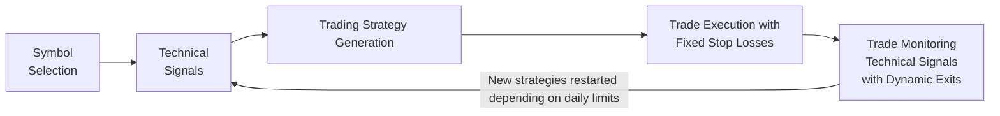
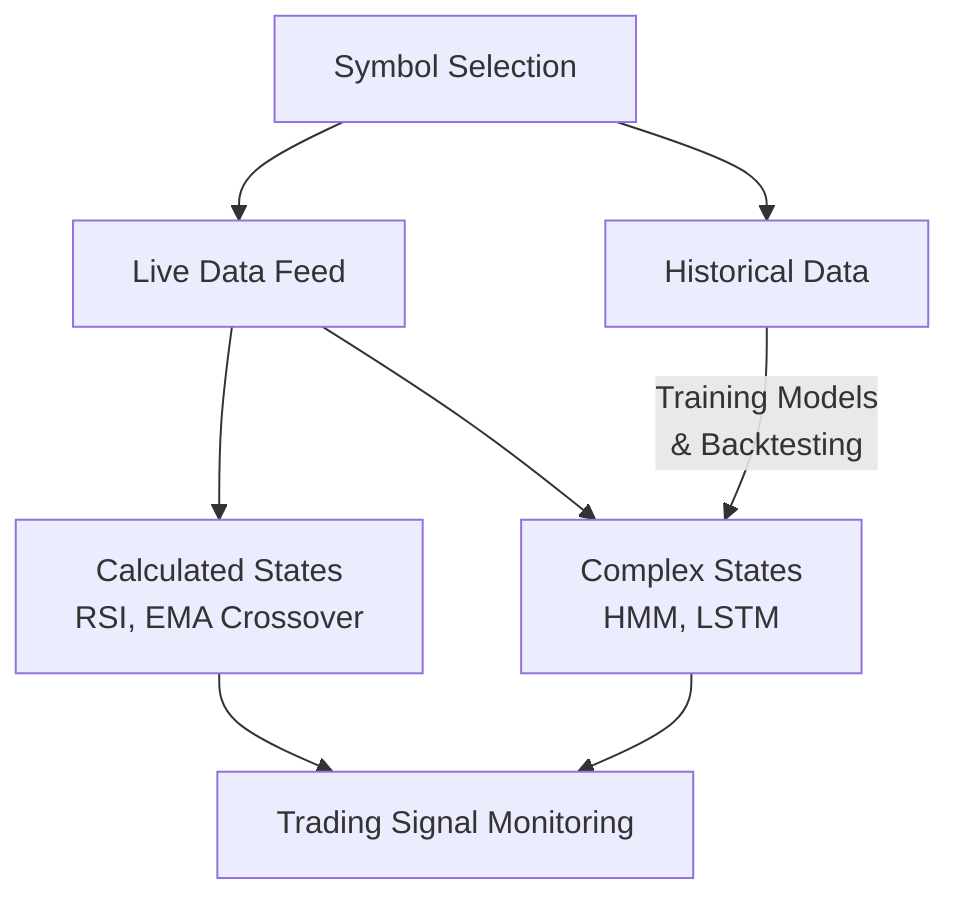
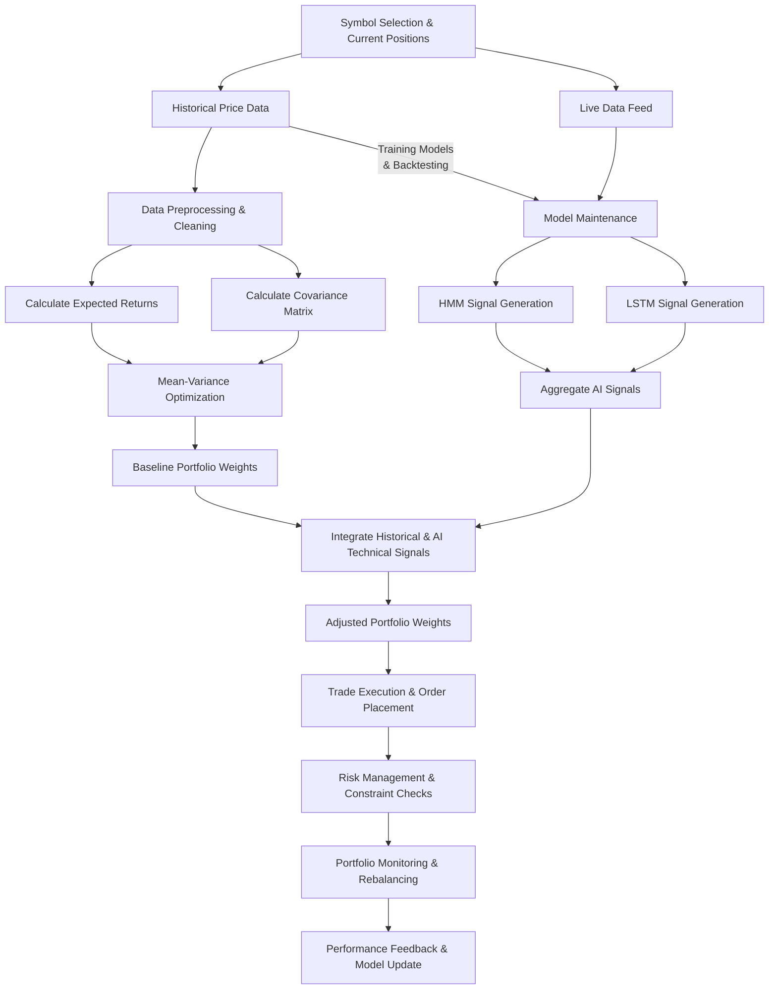
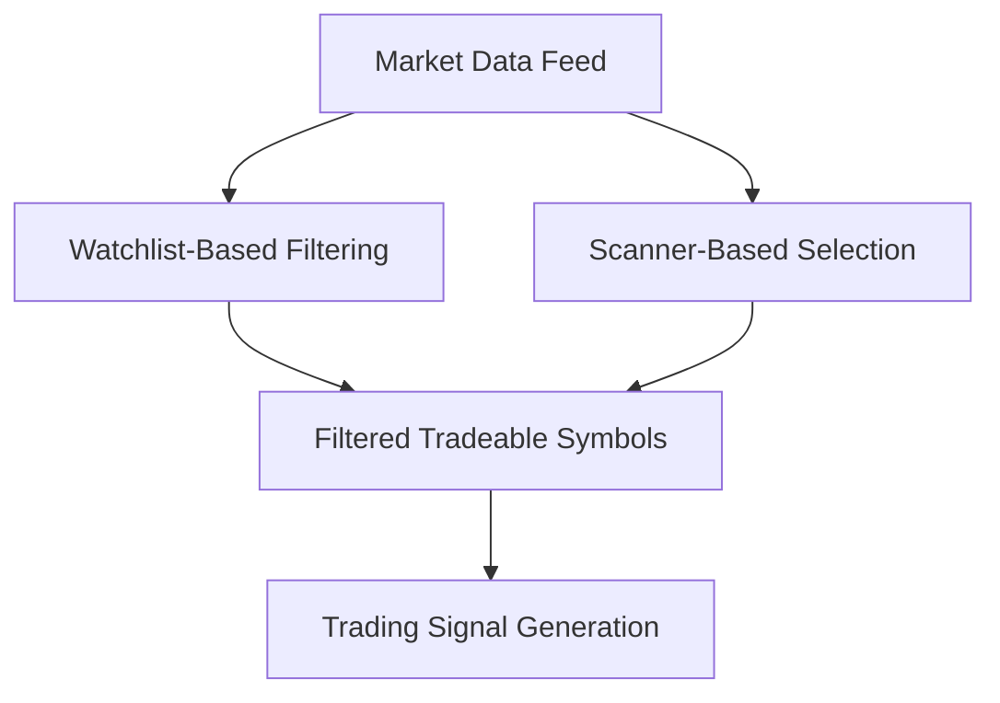

© 2025 Robert Costa. All rights reserved.
This project is licensed under the GNU General Public License v3.0. You are free
to use, modify, and distribute this software under the terms of this license.
For more details, see the [LICENSE](./LICENSE) file.

# Trading System Architectural Concepts

Our trading system is designed to support a broad range of strategies:

- **Day Trading & Swing Trading:**  
  These strategies last from a few minutes up to a few days. They typically 
  focus on futures or options to capture short-term market inefficiencies. 
  The system generates quick, actionable signals and executes trades with 
  pre-set stop losses.

- **Long-Term Strategies:**  
  This component can include approaches like buying deep in-the-money options 
  (or LEAPS) as a form of "equity replacement." While these strategies might 
  be managed separately, ideally they form a component of overall portfolio 
  optimization.

- **Recurring Options Income Strategies:**  
  For trades that need an underlying stock position (e.g., the wheel strategy),
  our platform is designed to accommodate and integrate these strategies, 
  effectively bridging short-term and long-term trading approaches.

## Day and Swing Trading

### Diagram 1: Overall Short-Term Trading System Architecture

This diagram shows the process flow from generating trading strategies based on
technical signals, through executing trades with fixed stop losses, and finally
ongoing monitoring positions with dynamic exits. New strategies are placed on a 
rolling basis within the hardcoded daily limits and availability of capital. See
[Symbol Selection Strategies](#symbol-selection-strategies) for symbol choosing.

### Diagram 2: Short-Term Trading Signal Generation Pipeline

This diagram breaks down the process of generating trading signals by combining
a live data feed and historical data. Simple indicators (e.g., RSI, EMA
crossover) produce basic calculated states, while more complex processing
(via HMM and LSTM models) generates advanced states. Both feed into the overall
trading signal monitoring system. See
[Symbol Selection Strategies](#symbol-selection-strategies) for symbol choosing.

## Long-Term Portfolio Management and Optimization

This system combines classical portfolio optimization with advanced AI-based.
signal generation. The idea is to leverage historical data to calculate expected
returns and risk (covariance) while simultaneously incorporating real-time
signals to dynamically adjust the portfolio. This dual approach aims to improve
long-term portfolio construction and management. See
[Symbol Selection Strategies](#symbol-selection-strategies) for symbol choosing.

### System Components

1. **Historical Data Pipeline:**
   - **Historical Price Data:** Ingest historical prices.
   - **Data Preprocessing & Cleaning:** Prepare the data for analysis.
   - **Expected Returns & Covariance:** Calculate statistical metrics for
     portfolio optimization.
   - **Mean-Variance Optimization:** Generate baseline portfolio weights.

2. **Real-Time AI Signals:**
   - **Live Data Feed:** Capture current market data.
   - **Real-Time Processing:** Clean and format live data.
   - **HMM Signal Generation:** Generate predictive signals using Hidden Markov
     Models.
   - **LSTM Signal Generation:** Generate predictive signals using LSTM networks.
   - **Aggregation:** Combine the AI signals into an overall adjustment factor.

3. **Portfolio Integration & Execution:**
   - **Integration:** Merge historical optimization outputs with AI signal
     adjustments.
   - **Adjusted Portfolio Weights:** Produce final portfolio allocations.
   - **Trade Execution:** Place trades based on the adjusted portfolio.
   - **Risk Management & Monitoring:** Apply stop losses, rebalance, and update
     the model based on performance feedback.

### Diagram 3: Portfolio Optimization System Flow Diagram

## Symbol Selection Strategies

Determining which assets to trade is crucial for strategy execution. There 
are three main approaches we will support:

- **Watchlist-Based Selection:** Focuses on a predefined set of symbols, 
  ensuring consistency and reducing noise. This approach works well for 
  traders who prefer to specialize in familiar assets.
  
- **Scanner-Based Selection:** Dynamically identifies tradeable assets based 
  on technical criteria such as volatility, volume, trend strength, or 
  unusual options activity. This method helps capture emerging opportunities.

- **Hybrid Approach:** Uses a scanner to discover new trade opportunities 
  while maintaining a core watchlist. Assets can be added or removed based 
  on scanner signals and performance over time.

### Diagram 4: Symbol Selection Process

This diagram illustrates the different pathways for symbol selection, 
showing how market data feeds into both static watchlists and dynamic scanners.

