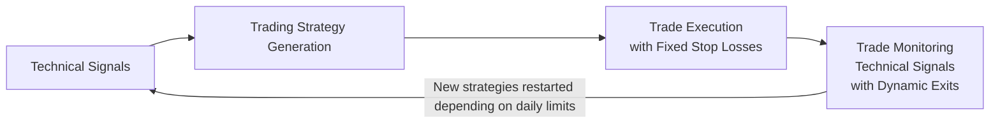
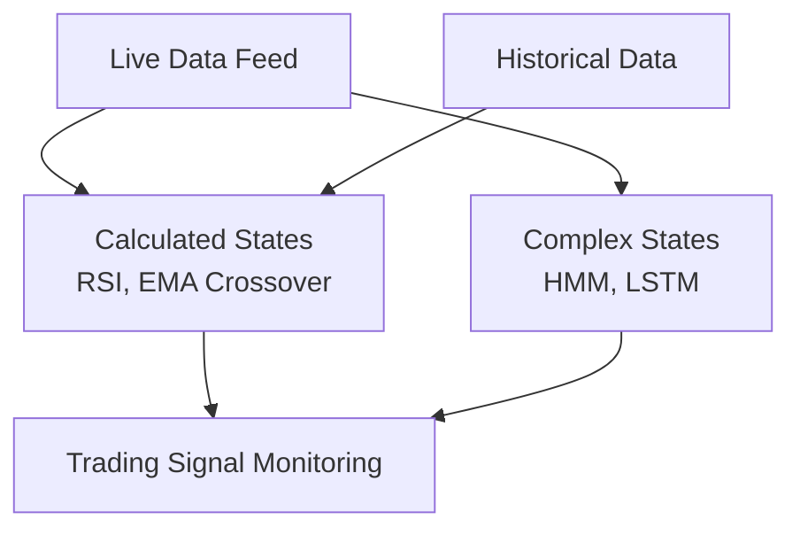

# Trading System Architectural Concepts

## Diagram 1: Overall Trading System Architecture

This diagram shows the process flow from generating trading strategies based on
technical signals, through executing trades with fixed stop losses, and finally
ongoing monitoring positions with dynamic exits. New strategies are placed on a 
rolling basis within the hardcoded daily limits and availability of capital.

## Diagram 2: Trading Signal Generation Pipeline

This diagram breaks down the process of generating trading signals by combining
a live data feed and historical data. Simple indicators (e.g., RSI, EMA
crossover) produce basic calculated states, while more complex processing
(via HMM and LSTM models) generates advanced states. Both feed into the overall
trading signal monitoring system.

